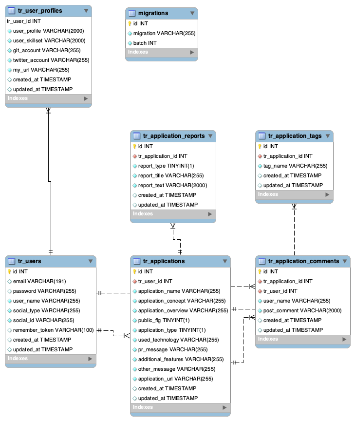

## このアプリケーションは何？

公開中サイト：  [個人.dev](https://kojin.dev)

以下を目的として、個人で開発・運営されているサイトです。

- 開発者自身の技術力向上のため
  - ソースを公開し、他人に見られて恥ずかしくないコードを書きながらサイトを運営、機能改修していくことで  技術力向上を行っていきます。
- 個人開発者の交流のため
  - 個人開発を行っている人同士でコミュニティを作り、切磋琢磨して行けるようにすること。

- 本業の仕事獲得のため
  - 現在私は小規模なWeb系開発会社に、正社員として在籍しております。  
  こちらのサイトを閲覧した人から仕事の紹介を頂いたり、本業にも活かせればと考えています。
  
## 環境構築方法
- 準備
  - Dockerのインストール
  
- ビルド＆ライブラリインストール  
`clone https://github.com/hiroyuki-w/kojindev`  
`cd kojindev`  
`docker-compose up -d`  
`docker-compose exec app composer install`  
`cp ./backend/.env.example ./backend/.env`  
`docker-compose exec app  php artisan migrate --seed`  
`docker-compose exec app  php artisan storage:link`  

- Laravel設定ファイル(./backend/.env)の編集  
URLやDB接続先など基本的な設定は記述済みのため、以下の項目を書き換える

|項目  |意味  |
|---|---|
|GOOGLE_CLIENT_ID|Google Cloud APIsのクライアントID|
|GOOGLE_CLIENT_SECRET|Google Cloud APIsのクライアントシークレット|
|GITHUB_CLIENT_ID|GitHubのOAuthAppクライアントID|
|GITHUB_CLIENT_SECRET|GitHubのOAuthAppのクライアントシークレット|
|TWITTER_CLIENT_ID|Twitterアプリのクライアントシークレット|
|TWITTER_CLIENT_SECRET|Twitterアプリのクライアントシークレット|
|GOOGLE_ANALYTICS_TRACKING_ID|GoogleAnalyticsのトラッキングID|

ログインはSNSログインしか機能がないため、いずれかのキーの取得が必要。  
Githubの取得が一番簡単と思われます。  
Google/GithubのAPIキー取得方法については、以下参考に  
[Google](https://cloud.google.com/docs/authentication/api-keys)  
[GitHub](https://developer.github.com/apps/building-oauth-apps/)  

- 疎通確認  
下記URLへアクセス  
https://local.kojin.dev:8020/

## 設計
- ER図  

## コンタクト  
開発者へ連絡を取りたい場合は以下のメールか、Twitterへ  
kojin.dev@gmail.com  
https://twitter.com/kojindev  

